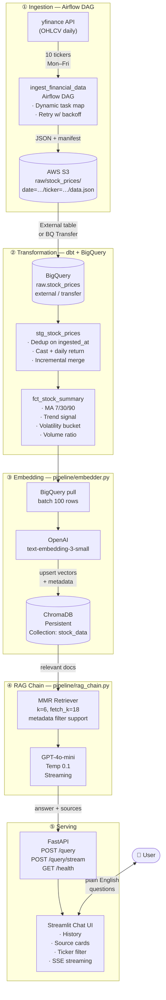

# RAG Financial Data Assistant

[](https://www.python.org/downloads/release/python-3110/)
[](https://fastapi.tiangolo.com)
[](https://streamlit.io)
[](https://python.langchain.com)
[](https://www.getdbt.com)
[](https://airflow.apache.org)
[](https://cloud.google.com/bigquery)
[](https://aws.amazon.com/s3/)
[](https://www.trychroma.com)
[](https://docs.docker.com/compose/)
[](https://github.com/vikasraogudipudi/rag-financial-assistant/actions/workflows/ci.yml)
[](LICENSE)

> Ask financial questions in plain English. Get answers grounded in real daily market data.

A production-grade data engineering portfolio project that combines a modern ELT stack (Airflow → S3 → dbt → BigQuery) with a full RAG pipeline (OpenAI embeddings → ChromaDB → GPT-4o-mini) to power a conversational financial analyst.

---

## Architecture



---

## Tech Stack

| Layer | Technology | Purpose |
|---|---|---|
| Ingestion | Apache Airflow 2.9 | Orchestrate daily yfinance → S3 loads |
| Raw storage | AWS S3 | Hive-partitioned JSON landing zone |
| Transformation | dbt 1.8 + BigQuery | Dedup, cast, window functions, trend signals |
| Vector store | ChromaDB 0.5 | Persist and query embedding vectors |
| Embeddings | OpenAI `text-embedding-3-small` | Semantic document representation |
| RAG | LangChain 0.2 + GPT-4o-mini | Retrieval-augmented generation |
| Backend API | FastAPI 0.111 + Uvicorn | REST + SSE endpoints |
| Frontend | Streamlit 1.36 | Chat UI with source attribution |
| Packaging | Docker + Docker Compose | One-command local deployment |
| CI/CD | GitHub Actions | Lint, type check, test, Docker build |

## Tracked Equities

`AAPL` · `MSFT` · `GOOGL` · `AMZN` · `META` · `TSLA` · `NVDA` · `JPM` · `V` · `JNJ`

---

## Quick Start

### Prerequisites

| Tool | Version |
|---|---|
| Docker + Docker Compose | 24+ / 2.24+ |
| Python (local dev) | 3.11 |
| OpenAI API key | — |
| GCP project + service account | BigQuery Editor role |
| AWS credentials | S3 read/write on your bucket |

### 1. Clone and configure

```bash
git clone https://github.com/vikasraogudipudi/rag-financial-assistant.git
cd rag-financial-assistant

cp .env.example .env
# Fill in OPENAI_API_KEY, GCP_PROJECT, GCP_SA_KEY_PATH, AWS_* and S3_BUCKET
mkdir -p secrets
cp /path/to/your/gcp-sa.json secrets/gcp-sa.json
```

### 2. Start core services

```bash
docker compose up -d chromadb api ui
```

| Service | URL |
|---|---|
| Streamlit UI | http://localhost:8501 |
| FastAPI docs | http://localhost:8001/docs |
| ChromaDB | http://localhost:8000 |

### 3. Run the embedding pipeline

After your dbt mart is populated:

```bash
# Full load
docker compose --profile embed up embedder

# Incremental (only rows since a given date)
docker compose run embedder python -m pipeline.embedder --since 2024-01-01
```

### 4. Trigger the Airflow DAG

```bash
# With a local Airflow installation
airflow dags trigger ingest_financial_data

# Or via Airflow UI → DAGs → ingest_financial_data → Trigger DAG
```

### 5. Run dbt transformations

```bash
cd dbt_project
dbt deps
dbt run --profiles-dir .
dbt test --profiles-dir .
```

---

## Project Structure

```
rag-financial-assistant/
├── .github/workflows/
│   └── ci.yml                       # Lint · test · Docker build · dbt compile
│
├── dags/
│   └── ingest_financial_data.py     # Airflow DAG: yfinance → S3
│
├── dbt_project/
│   ├── dbt_project.yml
│   ├── packages.yml                 # dbt_utils dependency
│   ├── profiles.yml                 # dev + prod BigQuery profiles
│   └── models/
│       ├── staging/
│       │   ├── sources.yml          # raw.stock_prices source definition
│       │   └── stg_stock_prices.sql # Dedup · cast · incremental merge
│       └── marts/
│           └── fct_stock_summary.sql # MAs · trend · volatility · returns
│
├── pipeline/
│   ├── embedder.py                  # BigQuery → OpenAI → ChromaDB
│   └── rag_chain.py                 # LangChain retriever + GPT-4o-mini
│
├── app/
│   ├── api/
│   │   └── main.py                  # FastAPI: /query · /query/stream · /health
│   └── ui/
│       └── streamlit_app.py         # Chat UI with source cards & ticker filter
│
├── docker/
│   ├── Dockerfile.api               # Multi-stage, Python 3.11-slim
│   └── Dockerfile.ui
│
├── tests/
│   ├── test_api.py                  # FastAPI endpoint unit tests (mocked)
│   └── test_rag_chain.py            # RAG chain unit tests (mocked)
│
├── docker-compose.yml
├── requirements.txt
└── .env.example
```

---

## API Reference

### `POST /query`

```bash
curl -X POST http://localhost:8001/query \
  -H "Content-Type: application/json" \
  -d '{
    "question": "What is the 30-day trend for NVDA and how does volatility compare to AAPL?",
    "ticker_filter": ["NVDA", "AAPL"]
  }'
```

**Response:**

```json
{
  "answer": "Based on the data: NVDA shows a bullish trend with its close price above both MA(7) and MA(30)...",
  "sources": [
    {
      "ticker": "NVDA",
      "trade_date": "2024-06-14",
      "trend_signal": "bullish",
      "volatility_bucket": "high",
      "snippet": "Ticker: NVDA | Date: 2024-06-14 | Close: $1208.88..."
    }
  ],
  "latency_ms": 1847.3
}
```

### `POST /query/stream`

Same request body — returns `text/event-stream` SSE tokens as they are generated.

### `GET /health`

```json
{ "status": "ok", "version": "1.0.0", "chain_ready": true }
```

---

## dbt Models

### `stg_stock_prices`  _(incremental, partitioned by month, clustered by ticker)_

Cleans and deduplicates raw S3-sourced data. Picks the latest `ingested_at` when the same ticker+day appears more than once (DAG re-runs). Computes:
- `daily_return_pct` — `(close - open) / open`
- `intraday_range` — `high - low`

### `fct_stock_summary`  _(table, partitioned by month, clustered by ticker)_

Enriches staging with rolling window analytics:

| Column | Description |
|---|---|
| `ma_7d` / `ma_30d` / `ma_90d` | Rolling average close prices |
| `trend_signal` | `bullish` / `bearish` / `neutral` via MA crossover |
| `volatility_30d` | 30-day rolling std dev of daily returns |
| `volatility_bucket` | `low` / `medium` / `high` |
| `return_7d_pct` / `return_30d_pct` | Lagged price returns |
| `volume_ratio` | `volume / avg_volume_30d` |
| `is_latest` | `true` for the most recent row per ticker |

---

## Environment Variables

| Variable | Required | Default | Description |
|---|---|---|---|
| `OPENAI_API_KEY` | ✅ | — | OpenAI API key |
| `GCP_PROJECT` | ✅ | — | Google Cloud project ID |
| `GCP_SA_KEY_PATH` | ✅ | — | Path to GCP service account JSON |
| `S3_BUCKET` | ✅ | — | S3 bucket for raw data |
| `AWS_ACCESS_KEY_ID` | ✅ | — | AWS access key |
| `AWS_SECRET_ACCESS_KEY` | ✅ | — | AWS secret key |
| `AWS_DEFAULT_REGION` | ✅ | — | AWS region |
| `BQ_DATASET` | — | `marts` | BigQuery dataset name |
| `CHROMA_HOST` | — | `localhost` | ChromaDB host |
| `CHROMA_PORT` | — | `8000` | ChromaDB port |
| `RETRIEVAL_K` | — | `6` | Docs retrieved per query |
| `LLM_TEMPERATURE` | — | `0.1` | GPT-4o-mini temperature |

---

## Development

```bash
# Create virtualenv
python -m venv .venv && source .venv/bin/activate
pip install -r requirements.txt

# Lint
ruff check . && ruff format .

# Type check
mypy pipeline/ app/api/ --ignore-missing-imports

# Tests
pytest tests/ -v --cov

# dbt
cd dbt_project
dbt deps && dbt run --profiles-dir . && dbt test --profiles-dir .
```

---

## License

MIT © Vikas Rao
